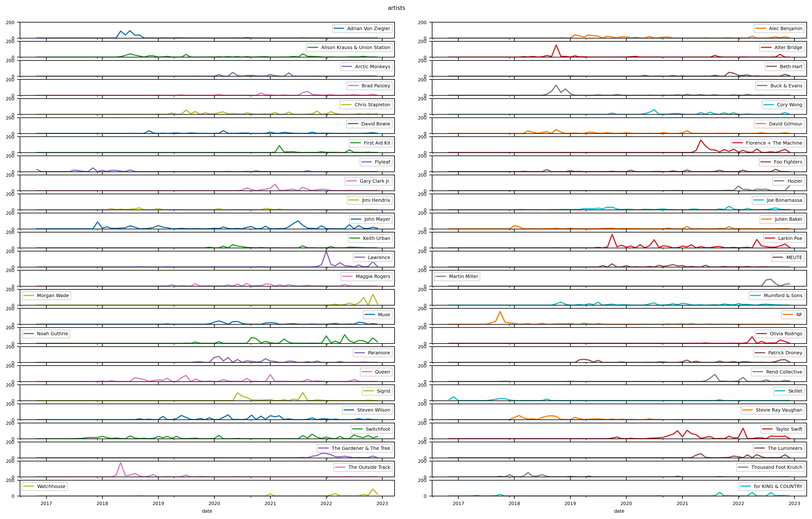
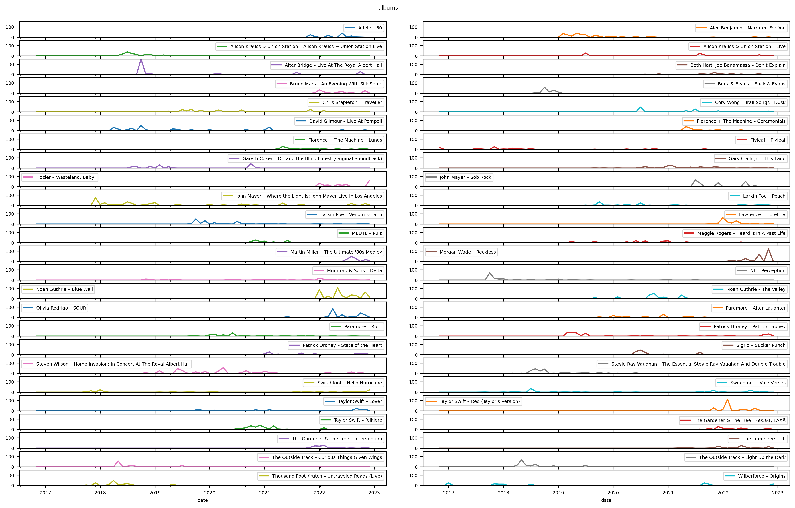
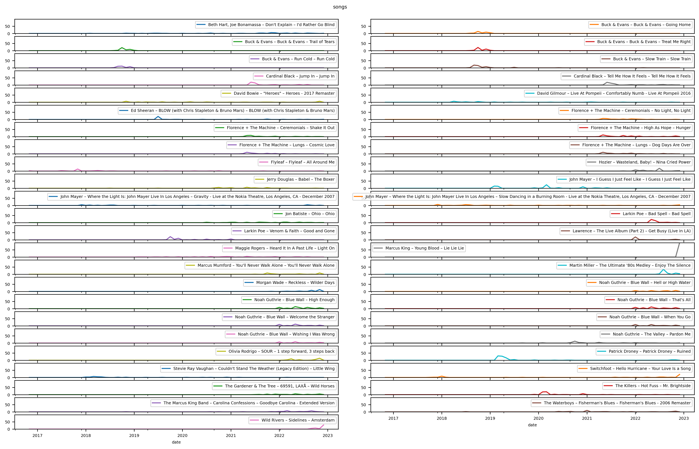

# Spotify Analysis

> Tools to analyze your Spotify extended play history

## `plots.py`

This script will create plots that show how often you played your most played songs, albums and artists over the years. Adjust the parameters marked with `Configuration` at the top of the file to your liking, install missing dependencies if necessary and run the script with `python3 plots.py`.

### Example output

